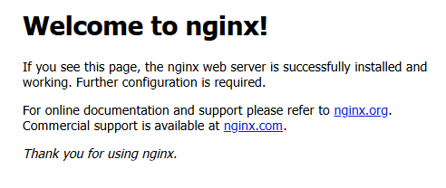

### 1. 가상환경 세팅
```bash
$ python -m venv venv
```
### 2. 가상환경 활성화
```bash
$ source venv/bin/activate 

$ source venv/Scripts/activate  # windows

$ venv\Scripts\activate.bat     # cmd
```

### 2-1. push 전 requirements.txt 생성
```bash
$ pip freeze > requirements.txt
```
### 2-2. pull 후 가상환경에 패키지 설치
```bash
$ pip install -r requirements.txt
```

### 3. 애플리케이션 실행
```bash
python run.py
```

### 가상환경 제거
```bash
rmdir /s /q venv # cmd
```
### pip upgrade
```bash
python -m pip install --upgrade pip
```

### 버전차이로 문제가 되는 패키지 재설치
```bash
pip uninstall ffmpeg-python
pip install ffmpeg-python
```

### 사용 방법
`config.ini` 파일을 생성 후 내부에 디렉토리를 지정한다
```
[settings]
secret_key = 
username = 
password = 

[directories]
video_directory1 =
video_directory2 = 
ffmpeg_directory = 

[paths]
ffmpeg_script_path = 
work_directory = 
```

### encodeURIComponent
JavaScript의 내장 함수로 URI의 특정 구성 요소를 인코딩하여 안전하게 전달한다<br>
의미를 가지는 일부문자를 이스케이프한다
```js
`/video/video/${encodeURIComponent(currentVideo)}?directory=${directory}`
```

### 인증서 생성
```bash
$ openssl req -x509 -newkey rsa:4096 -nodes -out cert.pem -keyout key.pem -days 365
```
```bash
Generating a RSA private key
................................................++++
........................................................................................++++
writing new private key to 'key.pem'
-----
You are about to be asked to enter information that will be incorporated
into your certificate request.
What you are about to enter is what is called a Distinguished Name or a DN.
There are quite a few fields but you can leave some blank
For some fields there will be a default value,
If you enter '.', the field will be left blank.
-----
Country Name (2 letter code) [AU]:
State or Province Name (full name) [Some-State]:
Locality Name (eg, city) []:
Organization Name (eg, company) [Internet Widgits Pty Ltd]:
Organizational Unit Name (eg, section) []:
Common Name (e.g. server FQDN or YOUR name) []:
Email Address []:
```
### nginx 서버
`https://nginx.org/en/download.html` 에서 zip 파일을 다운받고 푼다 <br>
`nginx.exe` 파일이 있는 위치에서 아래 명령어로 실행
```bash
start nginx
```
아래 명령어로 종료
```bash
nginx -s quit
```
아래 명령어로 재시작
```bash
nginx -s reload
```
절대 경로로 실행(git bash)
```bash
C:/nginx/nginx-1.26.2/nginx.exe &
C:/nginx/nginx-1.26.2/nginx.exe -s quit
C:/nginx/nginx-1.26.2/nginx.exe -s reload
```
실행 결과 <br>


- Nginx와 Flask 연동 <br>
  Flask 애플리케이션이 8090 포트에서 실행중이라면
```bash
waitress-serve --port=80 run:app
```
- nginx 설정 수정 (`/conf/nginx.conf`) <br>
80 포트를 내부서버 8090으로 연결
```bash
server {
    listen 80;
    server_name localhost;

    location / {
        proxy_pass http://127.0.0.1:8090;
        proxy_set_header Host $host;
        proxy_set_header X-Real-IP $remote_addr;
        proxy_set_header X-Forwarded-For $proxy_add_x_forwarded_for;
        proxy_set_header X-Forwarded-Proto $scheme;
    }
}
```
### ssl 적용

생성한 `cert.pem`, `key.pem`을 `conf`디렉토리의 `ssl`디렉토리에 넣는다<br>
```bash
server {
    listen 443 ssl;  # 443 포트에서 SSL을 사용
    server_name yourdomain.com;  # 또는 localhost

    ssl_certificate     ssl/cert.pem;   # 인증서 파일 경로
    ssl_certificate_key ssl/key.pem;    # 키 파일 경로
    
    ssl_session_cache    shared:SSL:1m;
    ssl_session_timeout  5m;

    ssl_protocols       TLSv1 TLSv1.1 TLSv1.2;  # SSL 프로토콜 (최신 TLS 버전을 사용하는 것이 좋음)
    ssl_prefer_server_ciphers  on;
    ssl_ciphers         HIGH:!aNULL:!MD5;       # 보안 설정

    location / {
        try_files $uri $uri/ =404;
        root   html;
        index  index.html index.htm;
        proxy_pass http://127.0.0.1:8090;
        proxy_set_header Host $host;
        proxy_set_header X-Real-IP $remote_addr;
        proxy_set_header X-Forwarded-For $proxy_add_x_forwarded_for;
        proxy_set_header X-Forwarded-Proto $scheme;
    }
}

```