## 가상환경 세팅
```bash
$ python -m venv venv
```
## 가상환경 활성화
```bash
$ source venv/bin/activate 

$ source venv/Scripts/activate  # windows (git bash)

$ venv\Scripts\activate.bat     # cmd (windows terminal)
```

## push 전 requirements.txt 생성
```bash
$ pip freeze > requirements.txt
```
## pull 후 가상환경에 패키지 설치
```bash
$ pip install -r requirements.txt
```

## 애플리케이션 실행
```bash
python run.py
```
<br>

---

## 가상환경 제거
```bash
rmdir /s /q venv # cmd
```
## pip upgrade
```bash
python -m pip install --upgrade pip
```

## 버전차이로 문제가 되는 패키지 재설치
```bash
pip uninstall ffmpeg-python
pip install ffmpeg-python
```

## encodeURIComponent
JavaScript의 내장 함수로 URI의 특정 구성 요소를 인코딩하여 안전하게 전달한다<br>
의미를 가지는 일부문자를 이스케이프한다
```js
`/video/video/${encodeURIComponent(currentVideo)}?directory=${directory}`
```
<br>

---
## nginx 서버 (windows)
`https://nginx.org/en/download.html` 에서 zip 파일을 다운받고 푼다 <br>
`nginx.exe` 파일이 있는 위치에서 아래 명령어로 실행
```bash
start nginx
```
아래 명령어로 종료
```bash
nginx -s quit
```
아래 명령어로 재시작
```bash
nginx -s reload
```
절대 경로로 실행(git bash)
```bash
/cnginx/nginx-1.26.2/nginx.exe &
/c/nginx/nginx-1.26.2/nginx.exe -s quit
/c/nginx/nginx-1.26.2/nginx.exe -s reload
```
Git Bash `~` (home)에서 실행하면 안되므로 직접 경로 이동 후 실행
```bash
cd /c/nginx/nginx-1.26.2
```

실행 결과 <br>

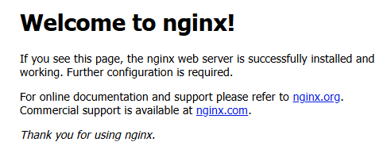
## nginx 재기동
```bash
cd /c/nginx/nginx-1.26.2

# graceful 종료
./nginx.exe -s quit

# 즉시 종료
./nginx.exe -s stop

# 기동 (백그라운드)
start ./nginx.exe

# 재기동 
./nginx.exe -s reload
```
작업스케줄러를 통해 실행되었다면 직접 제거 후 재기동한다
```bash
# Nginx 프로세스를 확인
tasklist | findstr nginx

# Nginx 프로세스를 강제 종료
taskkill /F /IM nginx.exe

# pid 파일 삭제
cd ..\..\nginx\nginx-1.26.2\logs
del nginx.pid
```
## Nginx와 Flask 연동 <br>
Flask 애플리케이션이 8090 포트에서 실행중이라면 nginx 설정 수정 (`/conf/nginx.conf`) <br>
80 포트를 내부서버 8090으로 연결
```bash
server {
    listen 80;
    server_name localhost;

    location / {
        proxy_pass http://127.0.0.1:8090;
        proxy_set_header Host $host;
        proxy_set_header X-Real-IP $remote_addr;
        proxy_set_header X-Forwarded-For $proxy_add_x_forwarded_for;
        proxy_set_header X-Forwarded-Proto $scheme;
    }
}
```
<br>

---
## 작업 스케줄러

- 작업 스케줄러 > 작업 만들기


- 트리거 > 새로 만들기

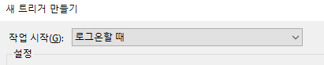

- 동작 > 새로 만들기

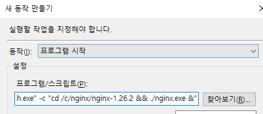 <br>
아래 값을 넣어서 nginx 서버 자동 시작<br>
스크립트 `"C:\Program Files\Git\bin\bash.exe"` <br>
인수 `-c "cd /c/nginx/nginx-1.26.2 && ./nginx.exe &"`

마찬가지로 python 서버 자동 시작<br>
스크립트 `wt.exe
`<br>
인수 `new-tab -p "Command Prompt" -d C:\my-project\random-player cmd /k "venv\Scripts\activate && python run.py"`

<br>

---
## 인증서 생성
자체 서명된(=self-signed) SSL 인증서 (개발용)
```bash
$ openssl req -x509 -newkey rsa:4096 -nodes -out cert.pem -keyout key.pem -days 365
```

인증서 확인 (인증서가 있는 디렉토리에서 git bash)
```bash
$ openssl x509 -in /c/nginx/nginx-1.26.2/ssl/chickchick.kr-fullchain.pem -noout -dates
```


## Let’s Encrypt 계열 무료 SSL 인증서 발급
무료 인증서로 만료기한은 3월이다<br>
사전 조건은 도메인을 등록해야 한다.
- certbot (리눅스/WSL/유닉스 계열에서 많이 씀)
```bash
sudo certbot certonly --webroot -w certbot -d www.chickchick.kr
```
- wacs.exe (Windows용 Let's Encrypt 클라이언트, win-acme)<br>

아래 설정 파일을 먼저 `nginx.conf` 에 추가<br>
그러면 인증서를 만들 때 `http://chickchick.kr/.well-known/acme-challenge/랜덤파일` 에 접근한다
```conf
    server {
        listen       80;
        server_name  chickchick.kr www.chickchick.kr;

        # 인증서 생성 후 주석
        # Let's Encrypt 인증 경로는 HTTPS 리다이렉트하지 않음
        location ^~ /.well-known/acme-challenge/ {
            root C:/nginx/nginx-1.26.2/html;
            default_type text/plain;
            try_files $uri =404;
            allow all;
        }

        # 나머지 요청만 HTTPS로 리다이렉트
        location / {
            root   html;
            index  index.html index.htm;
            return 301 https://$host$request_uri; # 인증서 생성 후 넣었음
        }
        
        # 인증서 테스트 200 응답 받아야 함
        # curl -i http://chickchick.kr/.well-known/acme-challenge/test.txt
        # curl -k -i https://chickchick.kr/.well-known/acme-challenge/test.txt
```
`wacs.exe` 가 설치된 디렉토리에서 아래 명령어 실행 `http-01 (FileSystem) 인증 방식`<br>
```bash
wacs.exe --target manual --host "chickchick.kr, www.chickchick.kr" --webroot "C:\nginx\nginx-1.26.2\html" --accepttos --validation filesystem --store pemfiles --pemfilespath "C:\nginx\nginx-1.26.2\ssl"
```
아래 파일이 생성된다<br>
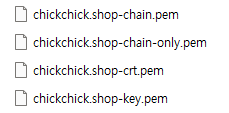

- fullchain 인증서를 생성한다(터미널)
```bash
copy chickchick.kr-crt.pem + chickchick.kr-chain.pem chickchick.kr-fullchain.pem
```

무료 인증서 기한 3개월이 지나면 인증서가 만료된다 > 갱신 필요

bash창에서 서버가 보내는 인증서로 만료기한 확인
```bash
$ openssl s_client -connect chickchick.kr:443 -servername chickchick.kr < /dev/null 2>/dev/null | openssl x509 -noout -dates

notBefore=May 27 07:22:59 2025 GMT
notAfter=Aug 25 07:22:58 2025 GMT
```
<br>

---

## Nginx SSL 적용


```bash
server {
    listen 443 ssl;
    server_name yourdomain.com;  # 또는 localhost

    ssl_certificate     ssl/cert.pem;   # 인증서 파일 경로
    ssl_certificate_key ssl/key.pem;    # 키 파일 경로
    
    ssl_session_cache    shared:SSL:1m;
    ssl_session_timeout  5m;

    ssl_protocols       TLSv1 TLSv1.1 TLSv1.2;  # SSL 프로토콜 (최신 TLS 버전을 사용하는 것이 좋음)
    ssl_prefer_server_ciphers  on;
    ssl_ciphers         HIGH:!aNULL:!MD5;       # 보안 설정

    location / {
        try_files $uri $uri/ =404;
        root   html;
        index  index.html index.htm;
        proxy_pass http://127.0.0.1:8090;
        proxy_set_header Host $host;
        proxy_set_header X-Real-IP $remote_addr;
        proxy_set_header X-Forwarded-For $proxy_add_x_forwarded_for;
        proxy_set_header X-Forwarded-Proto $scheme;
    }
}

```
`ssl_certificate` : 서버 인증서 + 체인(중간 인증서 포함) 파일<br>
win-acme에서는 `crt.pem`, `chain.pem`이 따로 생성되므로
`crt.pem`+`chain.pem`을 합쳐서 넣는다.
```bash
$ copy chickchick.kr-crt.pem + chickchick.kr-chain.pem chickchick.kr-fullchain.pem
```

<br>

---

## X-Accel-Redirect: 파일 전송을 nginx 에 맡기기
갤러리 이미지·영상은 Flask 가 **어떤 파일을 보낼지만 정하고**, 실제 파일 읽기·전송은 **nginx 가 직접** 한다. (2026-10-10 도입)

### 왜 필요한가
스크롤 중 이미지 15개가 한꺼번에 pending 되는 증상이 있었다. 원인은 waitress 구조다.

- waitress 는 Flask 코드를 작업 스레드(`threads=24`)에서 실행하지만, **소켓 입출력은 이벤트 루프 스레드 1개**가 전부 처리한다.
- `send_file` 응답은 작업 스레드를 바로 풀어주고, **파일을 읽어 보내는 일을 이 1개 스레드에 넘긴다** (`waitress/task.py` 의 `write_soon` → `channel._flush_some`).
- 갤러리 파일 대부분이 `\\wsl.localhost\...`(Docker Desktop 볼륨)라 읽기가 가끔 멈춘다. 그동안 **모든 응답 전송이 같이 멈춘다.**
- `_log_slow` 는 `send_file` 이 응답 객체를 돌려주는 순간까지만 재기 때문에 이 지연이 잡히지 않는다.

참고로 톰캣은 Poller 스레드 1개가 감시만 하고 실제 읽기·쓰기는 워커 스레드(기본 200개)가 하므로, 파일 하나가 느려도 그 요청만 막힌다.
nginx 는 워커 프로세스 여러 개 + 커널 `sendfile` 로 파일을 보내므로 같은 문제가 없다.

### 동작 흐름
```
1. 브라우저 → GET /image/images?filename=abc.png&dir=move
2. nginx    → Flask(8090) 로 전달 (+ X-Accel-Enabled: 1 헤더)
3. Flask    : 로그인 확인 → thumb/abc.webp 있나 확인 → 경로 결정
              응답: 본문 0바이트 + "X-Accel-Redirect: /_files/igdata/move/thumb/abc.webp"
4. nginx    : 이 헤더를 보고 응답을 브라우저에 보내지 않고 internal location 으로 내부 이동
              → \\wsl.localhost\...\_data\move\thumb\abc.webp 를 직접 읽음
5. nginx    → 브라우저 : 파일 전송 (Range 206, ETag/304 도 nginx 가 처리)
```
브라우저 입장에서는 그대로 `/image/images?...` 를 요청하고 이미지를 받는다. `/_files/...` 주소는 밖으로 드러나지 않는다.

### nginx 설정 (`conf/nginx.conf`, 443 server)
```bash
# Flask 가 돌려준 X-Accel-Redirect 의 목적지. 디스크에 이런 폴더가 있는 게 아니라 "주소 → 실제 폴더" 연결이다.
location ^~ /_files/igdata/ {
    internal;      # 브라우저가 직접 요청하면 404 — Flask 가 허락한 경우에만 열린다 (로그인 우회 방지)
    alias "//wsl.localhost/docker-desktop-data/data/docker/volumes/igdata/_data/";   # settings['UNC_DIR']
}
location ^~ /_files/temp/ {
    internal;
    alias "F:/merci_server_file_dir/";                                               # settings['TEMP_IMAGE_DIR']
}

location / {
    include snippets/proxy-params.conf;
    proxy_set_header X-Accel-Enabled 1;   # Flask 에 "nginx 뒤에 있으니 X-Accel-Redirect 써도 된다" 고 알림
    proxy_pass http://127.0.0.1:8090;
    ...
}
```
- `internal` : nginx 내부 이동(X-Accel-Redirect)으로만 열린다. 주소창에 `/_files/...` 를 치면 404.
- `^~` : 위의 정규식 location(`location ~ /\.`)보다 먼저 잡히게 한다.
- `alias` 경로는 슬래시(`/`)로 쓴다. UNC 경로·한글 폴더명 모두 동작한다.
- **nginx 가 사용자 계정으로 돌아야 한다.** Windows 서비스(SYSTEM 계정)로 돌리면 `\\wsl.localhost` 를 못 읽어 404 가 날 수 있다.

### Flask 코드 (`app/accel.py`)
```python
_ACCEL_ROOTS = [
    (settings['UNC_DIR'], '/_files/igdata/'),          # nginx.conf 의 internal location 과 짝
    (settings['TEMP_IMAGE_DIR'], '/_files/temp/'),
]

def send_file_accel(path, max_age=None, private=False, mimetype=None):
    uri = _accel_uri(path) if request.headers.get('X-Accel-Enabled') == '1' else None
    if uri is None:
        return send_file(path, conditional=True, max_age=max_age)   # 기존 방식으로 폴백
    resp = Response(status=200, mimetype=mimetype or _mimetype(path))
    resp.headers['X-Accel-Redirect'] = uri
    ...
```
- 경로는 `quote(rel, safe='/')` 로 퍼센트 인코딩한다. 한글·공백·`#`·`%`·`?`·`+` 가 들어간 파일명도 이래야 nginx 가 제대로 찾는다 (헤더는 latin-1 만 허용).
- **`Content-Type` 은 Flask 가 준 값이 그대로 나간다** (nginx 가 확장자로 다시 정하지 않음). 그래서 직접 넣는다. Python 3.8 `mimetypes` 는 `.webp` 를 몰라서 따로 매핑한다.
- `Cache-Control` 도 Flask 가 준 값이 그대로 나간다. 기존 `send_file` 과 같게 맞췄다 (이미지 `private, max-age=86400`, 영상 `no-cache`).
- 아래 경우는 기존 `send_file` 로 보낸다
  - `X-Accel-Enabled` 헤더가 없는 요청 (nginx 를 안 거친 개발 서버 직접 접속)
  - `_ACCEL_ROOTS` 밖의 파일 (`G:\`, `X:\` 영상 폴더, 주식 그래프 등)

적용된 곳

| 엔드포인트 | 함수 |
|---|---|
| `/image/images` | `app/image.py` `_send_cached` |
| `/video/temp-video` | `app/video.py` `get_temp_video` |
| `/video/temp-video-poster` | `app/video.py` `get_temp_video_poster` |
| `/video/videos` | `app/video.py` `get_video` (루트 안의 폴더만) |

폴더를 추가할 때는 `_ACCEL_ROOTS` 와 nginx `location ^~ /_files/...` 를 **같이** 추가한다.

### 동작 확인
nginx 접속 로그 끝에 응답 시간이 찍힌다 (`log_format timed`).
```
"GET /image/images?...&dir=move HTTP/2.0" 200 117402 ... rt=0.064 uct=0.004 uht=0.052 urt=0.055
```
| 값 | 의미 |
|---|---|
| `rt` | 요청 전체 시간 (브라우저로 보내기까지) |
| `uct` | 백엔드(waitress) 연결 |
| `uht` | 백엔드가 응답 헤더를 줄 때까지 |
| `urt` | 백엔드 응답 본문을 다 받을 때까지 |

- X-Accel 이 적용되면 Flask 는 헤더만 주므로 `uht` ≈ `urt` 이고 짧다.
- `uht` 가 길면 Flask 처리·waitress 대기열(작업 스레드 24개가 다 참)에서 막힌 것이다.
- `urt` 는 짧은데 `rt` 만 길면 nginx → 브라우저 구간(네트워크·디스크 읽기)이다.

백엔드가 실제로 X-Accel 을 쓰는지 직접 확인
```bash
curl -s -D - -o /dev/null -H "X-Accel-Enabled: 1" -b "<로그인 쿠키>" \
  "http://127.0.0.1:8090/image/images?filename=<파일명>&dir=move"
# Content-Length: 0 + X-Accel-Redirect: /_files/igdata/move/... 가 보이면 정상
```

### 되돌리기
nginx 의 `proxy_set_header X-Accel-Enabled 1;` 한 줄을 지우고 `./nginx.exe -s reload` 만 하면 된다.
Flask 가 자동으로 기존 `send_file` 방식으로 돌아가므로 **`run.py` 재시작이 필요 없다** (자동매매와 같은 프로세스라 재시작 없이 끌 수 있게 해 둠).

<br>

---

## 병렬 작업 비교
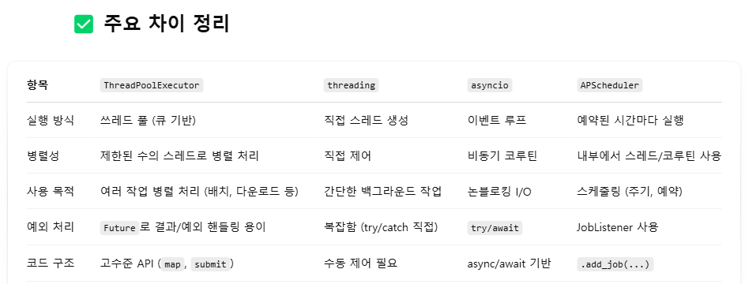
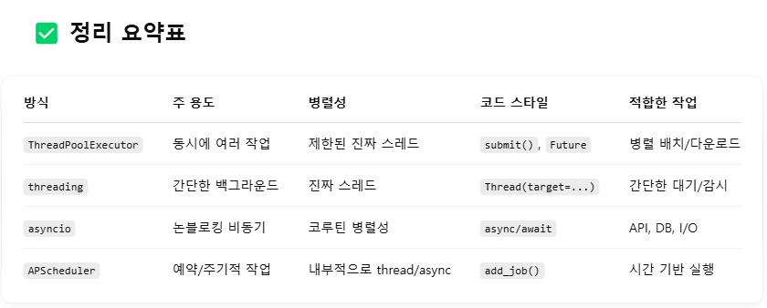
### 멀티스레드, 멀티프로세스, asyncio I/O 처리 관점
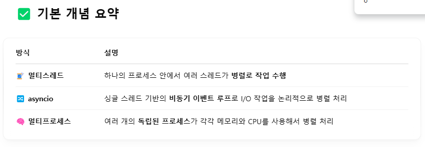
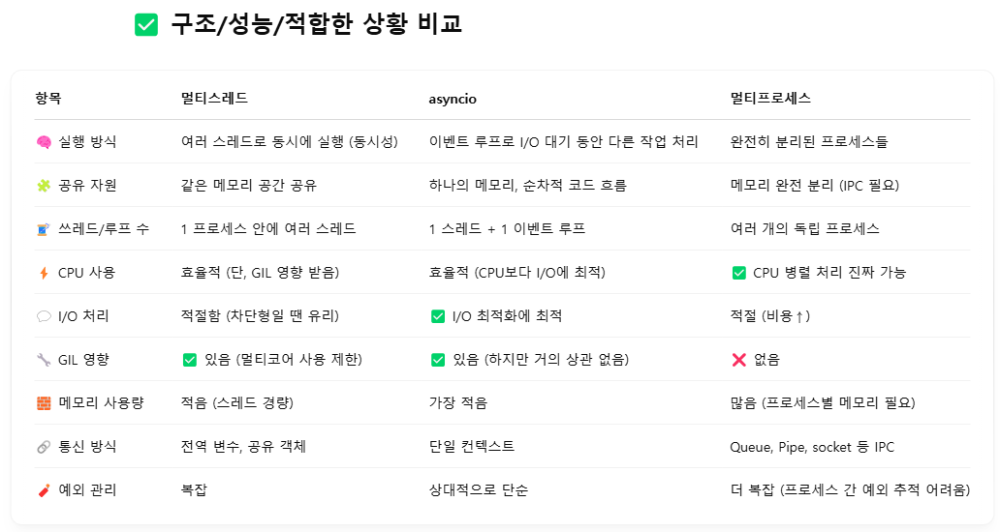
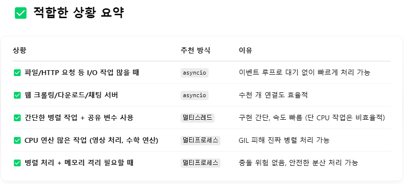
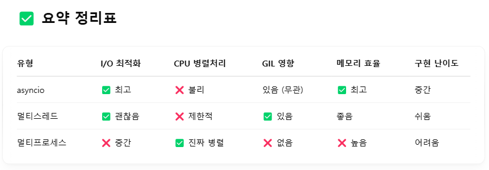
<br>

---
## Redis 설치
Redis를 Windows 서비스로 설치<br>
https://github.com/microsoftarchive/redis/releases 에 들어가서 msi파일 설치
```cmd
redis-server --service-install redis.windows.conf --loglevel verbose
```
이미 설치가 되어 있는 경우 삭제 후 서비스 설치
```cmd
taskkill /f /im redis-server.exe
```
서비스 실행
```cmd
redis-server --service-start
```
서비스 동작 확인
```cmd
C:\Redis>sc query redis

SERVICE_NAME: redis
        종류               : 10  WIN32_OWN_PROCESS
        상태               : 4  RUNNING
                                (STOPPABLE, NOT_PAUSABLE, ACCEPTS_PRESHUTDOWN)
        WIN32_EXIT_CODE    : 0  (0x0)
        SERVICE_EXIT_CODE  : 0  (0x0)
        검사점             : 0x0
        WAIT_HINT          : 0x0
```
`redis-cli.exe` 실행 후 테스트
```cmd
127.0.0.1:6379> ping
PONG
```
<br>

---
## PostgreSQL 도입
도커에 설치하기 위해 먼저 Docker Desktop을 실행 후 이미지 다운로드
```bash
docker pull postgres
```
다운받은 이미지로 컨테이너 실행
```bash
docker run --name mypg -e POSTGRES_PASSWORD=dlsdn317! -p 5432:5432 -d postgres
```
Docker Desktop이 실행되면 자동으로 컨테이너 실행
```bash
docker run --name mypg -e POSTGRES_PASSWORD=dlsdn317! -p 5432:5432 -d --restart unless-stopped postgres
또는
docker update --restart unless-stopped mypg
```
bash로 실행한 컨테이너 진입
```bash
docker exec -it mypg /bin/bash
```
dbeaver로 간단한 연결<br>
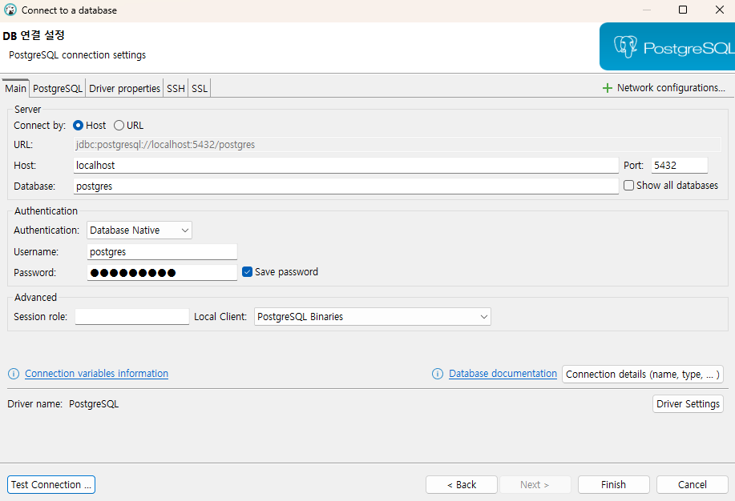
bash에서 psql로 PostgreSQL 접속<br>
`-U postgres` : postgres(관리자) 계정으로 접속<br>
`-d mydb` : 사용할 데이터베이스 이름
```bash
psql -U postgres -d mydb
```
```sql
CREATE USER chick WITH PASSWORD 'password';
CREATE DATABASE mydb OWNER myuser;
```
PostgreSQL 데이터베이스 접속 명령어
```sql
\c mydb chick

\dt : 현재 DB의 테이블 목록 보기

\du : 유저 목록 보기

\q : psql 종료
```
DB 시간이 안맞아서 한국시간으로 변경
```bash
vi /var/lib/postgresql/data/postgresql.conf

vi 없으면
echo "timezone = 'Asia/Seoul'" >> postgresql.conf

이후 컨테이너 재시작
docker restart <container>
```


문법 차이
```sql
ALTER TABLE users ADD login_attempt NUMERIC(1,0);
ALTER TABLE users ALTER COLUMN password TYPE VARCHAR(256);
ALTER TABLE users RENAME COLUMN login_id TO username;

SELECT conname FROM pg_constraint WHERE conrelid = 'chats'::regclass;
ALTER TABLE chats DROP CONSTRAINT chats_message_key;

SELECT setval('chats_id_seq', (SELECT MAX(id) FROM chats));

GRANT ALL PRIVILEGES ON TABLE chat_rooms TO myuser;
GRANT SELECT ON ALL TABLES IN SCHEMA public TO myuser;
```

파이썬에서 db 연결
```bash
pip install psycopg-binary
```
`app/repository/users/users.py` 참고<br>
(설치가 안되는 이슈가 있으면 윈도우에 PostgreSql을 설치하고 Path 에 bin 경로 추가 필요)

## UNIQUE 인덱스 만들어서 ON CONFLICT 사용해보기 (MERGE)
```sql
CREATE UNIQUE INDEX IF NOT EXISTS stocks_code_daily
ON interest_stocks (stock_code, (created_at::date));
```
```sql
INSERT INTO interest_stocks (
    created_at, nation, stock_code, stock_name, pred_price_change_3d_pct,
    yesterday_close, current_price, today_price_change_pct,
    avg5d_trading_value, current_trading_value, trading_value_change_pct,
    image_url
    -- , updated_at
)
VALUES (
    now(), %s, %s, %s, %s,
    %s, %s, %s,
    %s, %s, %s,
    %s
    -- , now()
)
   -- ON CONFLICT ON CONSTRAINT stocks_code_daily
ON CONFLICT (stock_code, (created_at::date))
    DO UPDATE SET
    nation                     = EXCLUDED.nation,
    stock_code                 = EXCLUDED.stock_code,
    stock_name                 = EXCLUDED.stock_name,
    pred_price_change_3d_pct   = EXCLUDED.pred_price_change_3d_pct,
    yesterday_close            = EXCLUDED.yesterday_close,
    current_price              = EXCLUDED.current_price,
    today_price_change_pct     = EXCLUDED.today_price_change_pct,
    avg5d_trading_value        = EXCLUDED.avg5d_trading_value,
    current_trading_value      = EXCLUDED.current_trading_value,
    trading_value_change_pct   = EXCLUDED.trading_value_change_pct,
    graph_file                  = EXCLUDED.graph_file
    -- , updated_at            = now()
RETURNING id;
```


## gsutil 설치

- 설치 (리눅스/Mac/WSL)
```bash
curl -O https://dl.google.com/dl/cloudsdk/channels/rapid/downloads/google-cloud-sdk-456.0.0-linux-x86_64.tar.gz
tar -xf google-cloud-sdk-456.0.0-linux-x86_64.tar.gz
./google-cloud-sdk/install.sh


```
- 설치 후 환경설정
```bash
./google-cloud-sdk/bin/gcloud init
```

- windows 설치 (powershell) <br>
https://cloud.google.com/sdk/docs/install?hl=ko
```bash
(New-Object Net.WebClient).DownloadFile("https://dl.google.com/dl/cloudsdk/channels/rapid/GoogleCloudSDKInstaller.exe", "$env:Temp\GoogleCloudSDKInstaller.exe")

& $env:Temp\GoogleCloudSDKInstaller.exe
    
```

## 이슈 
- 구글 패키지 꼬임 

```bash
pip list | findstr google 

pip uninstall google google-cloud google-cloud-api google-cloud-core googleapis-common-protos protobuf

pip install --upgrade pip
pip install --upgrade google-cloud-speech google-cloud-storage protobuf

```
- 캐시/컴파일 삭제
```bash
find . -name "*.pyc" -delete
find . -name "__pycache__" -delete
```

## pip 복구 및 업그레이드
```bash
$ python -m ensurepip --upgrade

$ python -m pip install --upgrade pip

```

# Coturn 서버
- 외부 마운트 경로 확인

```bash
docker inspect coturn \
  --format '{{range .Mounts}}{{println .Type ":" .Source "->" .Destination}}{{end}}'
  
bind : C:\nginx\nginx-1.26.2\ssl\chickchick.kr-key.pem -> /etc/coturn/privkey.pem
bind : C:\Users\user\turnserver.conf -> /etc/coturn/turnserver.conf
volume : /var/lib/docker/volumes/1958c59aaa327443c987d442380e353b5f6b6e142aedd09ed0f177ed2c575f48/_data -> /var/lib/coturn
bind : C:\nginx\nginx-1.26.2\ssl\chickchick.kr-fullchain.pem -> /etc/coturn/fullchain.pem

```

## git 메세지 규칙

feat: 새로운 기능 추가
fix: 버그 수정
docs: 문서 수정
style: 코드 동작 변화 없는 스타일 수정
refactor: 기능 변화 없는 구조 개선
test: 테스트 추가/수정
chore: 빌드, 설정, 패키지 같은 잡일
perf: 성능 개선
build: 빌드 시스템, 의존성 관련
ci: CI/CD 설정 변경