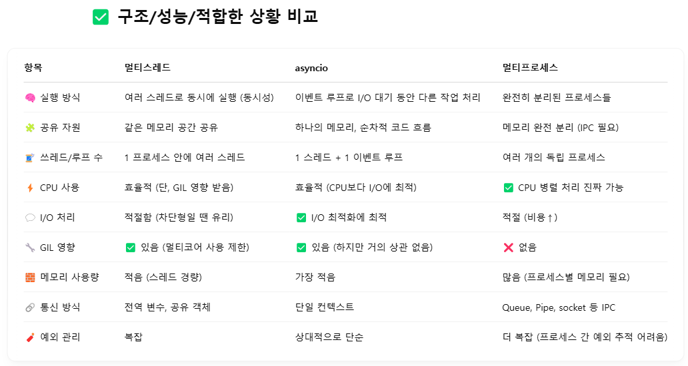

## 가상환경 세팅
```bash
$ python -m venv venv
```
## 가상환경 활성화
```bash
$ source venv/bin/activate 

$ source venv/Scripts/activate  # windows (git bash)

$ venv\Scripts\activate.bat     # cmd (windows terminal)
```

## push 전 requirements.txt 생성
```bash
$ pip freeze > requirements.txt
```
## pull 후 가상환경에 패키지 설치
```bash
$ pip install -r requirements.txt
```

## 애플리케이션 실행
```bash
python run.py
```
<br>

---

## 가상환경 제거
```bash
rmdir /s /q venv # cmd
```
## pip upgrade
```bash
python -m pip install --upgrade pip
```

## 버전차이로 문제가 되는 패키지 재설치
```bash
pip uninstall ffmpeg-python
pip install ffmpeg-python
```

## encodeURIComponent
JavaScript의 내장 함수로 URI의 특정 구성 요소를 인코딩하여 안전하게 전달한다<br>
의미를 가지는 일부문자를 이스케이프한다
```js
`/video/video/${encodeURIComponent(currentVideo)}?directory=${directory}`
```
<br>

---
## nginx 서버 (windows)
`https://nginx.org/en/download.html` 에서 zip 파일을 다운받고 푼다 <br>
`nginx.exe` 파일이 있는 위치에서 아래 명령어로 실행
```bash
start nginx
```
아래 명령어로 종료
```bash
nginx -s quit
```
아래 명령어로 재시작
```bash
nginx -s reload
```
절대 경로로 실행(git bash)
```bash
C:/nginx/nginx-1.26.2/nginx.exe &
C:/nginx/nginx-1.26.2/nginx.exe -s quit
C:/nginx/nginx-1.26.2/nginx.exe -s reload
```
실행 결과 <br>


## nginx 재기동
```bash
cd /c/nginx/nginx-1.26.2
# graceful 종료
./nginx.exe -s quit
# 즉시 종료
./nginx.exe -s stop
# 기동 (백그라운드)
start ./nginx.exe
# 재기동 
./nginx.exe -s reload
```
작업스케줄러를 통해 실행되었다면 직접 제거 후 재기동한다
```bash
# Nginx 프로세스를 확인
tasklist | findstr nginx
# Nginx 프로세스를 강제 종료
taskkill /F /IM nginx.exe
# pid 파일 삭제
cd ..\..\nginx\nginx-1.26.2\logs
del nginx.pid
```
## Nginx와 Flask 연동 <br>
Flask 애플리케이션이 8090 포트에서 실행중이라면 nginx 설정 수정 (`/conf/nginx.conf`) <br>
80 포트를 내부서버 8090으로 연결
```bash
server {
    listen 80;
    server_name localhost;

    location / {
        proxy_pass http://127.0.0.1:8090;
        proxy_set_header Host $host;
        proxy_set_header X-Real-IP $remote_addr;
        proxy_set_header X-Forwarded-For $proxy_add_x_forwarded_for;
        proxy_set_header X-Forwarded-Proto $scheme;
    }
}
```
<br>

---
## 작업 스케줄러

- 작업 스케줄러 > 작업 만들기


- 트리거 > 새로 만들기


- 동작 > 새로 만들기

 <br>
아래 값을 넣어서 nginx 서버 자동 시작<br>
스크립트 `"C:\Program Files\Git\bin\bash.exe"` <br>
인수 `-c "cd /c/nginx/nginx-1.26.2 && ./nginx.exe &"`

마찬가지로 python 서버 자동 시작<br>
스크립트 `wt.exe
`<br>
인수 `new-tab -p "Command Prompt" -d C:\my-project\random-player cmd /k "venv\Scripts\activate && python run.py"`

<br>

---
## 인증서 생성
자체 서명된(=self-signed) SSL 인증서 (개발용)
```bash
$ openssl req -x509 -newkey rsa:4096 -nodes -out cert.pem -keyout key.pem -days 365
```


## Let’s Encrypt 계열 무료 SSL 인증서 발급
무료 인증서로 만료기한은 3월이다<br>
사전 조건은 도메인을 등록해야 한다.
- certbot (리눅스/WSL/유닉스 계열에서 많이 씀)
```bash
sudo certbot certonly --webroot -w certbot -d www.chickchick.shop
```
- wacs.exe (Windows용 Let's Encrypt 클라이언트, win-acme)<br>
wacs.exe 가 설치된 디렉토리에서 아래 명령어 실행
```bash
wacs.exe --target manual --host "chickchick.shop, www.chickchick.shop" --webroot "C:\nginx\nginx-1.26.2\html" --accepttos --validation filesystem --store pemfiles --pemfilespath "C:\nginx\nginx-1.26.2\ssl"
```
아래 파일이 생성된다<br>


- fullchain 인증서를 생성한다
```bash
copy chickchick.shop-crt.pem + chickchick.shop-chain.pem chickchick.shop-fullchain.pem
```

무료 인증서 기한 3개월이 지나면 인증서가 만료된다 > 갱신 필요

bash창에서 서버가 보내는 인증서로 만료기한 확인
```bash
$ openssl s_client -connect chickchick.shop:443 -servername chickchick.shop < /dev/null 2>/dev/null | openssl x509 -noout -dates

notBefore=May 27 07:22:59 2025 GMT
notAfter=Aug 25 07:22:58 2025 GMT
```
<br>

---

## Nginx SSL 적용


```bash
server {
    listen 443 ssl;
    server_name yourdomain.com;  # 또는 localhost

    ssl_certificate     ssl/cert.pem;   # 인증서 파일 경로
    ssl_certificate_key ssl/key.pem;    # 키 파일 경로
    
    ssl_session_cache    shared:SSL:1m;
    ssl_session_timeout  5m;

    ssl_protocols       TLSv1 TLSv1.1 TLSv1.2;  # SSL 프로토콜 (최신 TLS 버전을 사용하는 것이 좋음)
    ssl_prefer_server_ciphers  on;
    ssl_ciphers         HIGH:!aNULL:!MD5;       # 보안 설정

    location / {
        try_files $uri $uri/ =404;
        root   html;
        index  index.html index.htm;
        proxy_pass http://127.0.0.1:8090;
        proxy_set_header Host $host;
        proxy_set_header X-Real-IP $remote_addr;
        proxy_set_header X-Forwarded-For $proxy_add_x_forwarded_for;
        proxy_set_header X-Forwarded-Proto $scheme;
    }
}

```
`ssl_certificate` : 서버 인증서 + 체인(중간 인증서 포함) 파일<br>
win-acme에서는 `crt.pem`, `chain.pem`이 따로 생성되므로
`crt.pem`+`chain.pem`을 합쳐서 넣는다.
```bash
$ copy chickchick.shop-crt.pem + chickchick.shop-chain.pem fullchain.pem
```
<br>

---

## 병렬 작업 비교


### 멀티스레드, 멀티프로세스, asyncio I/O 처리 관점




<br>

---
## Redis 설치
Redis를 Windows 서비스로 설치<br>
https://github.com/microsoftarchive/redis/releases 에 들어가서 msi파일 설치
```cmd
redis-server --service-install redis.windows.conf --loglevel verbose
```
이미 설치가 되어 있는 경우 삭제 후 서비스 설치
```cmd
taskkill /f /im redis-server.exe
```
서비스 실행
```cmd
redis-server --service-start
```
서비스 동작 확인
```cmd
C:\Redis>sc query redis

SERVICE_NAME: redis
        종류               : 10  WIN32_OWN_PROCESS
        상태               : 4  RUNNING
                                (STOPPABLE, NOT_PAUSABLE, ACCEPTS_PRESHUTDOWN)
        WIN32_EXIT_CODE    : 0  (0x0)
        SERVICE_EXIT_CODE  : 0  (0x0)
        검사점             : 0x0
        WAIT_HINT          : 0x0
```
`redis-cli.exe` 실행 후 테스트
```cmd
127.0.0.1:6379> ping
PONG
```
<br>

---
## PostgreSQL 도입
도커에 설치하기 위해 먼저 Docker Desktop을 실행 후 이미지 다운로드
```bash
docker pull postgres
```
다운받은 이미지로 컨테이너 실행
```bash
docker run --name mypg -e POSTGRES_PASSWORD=dlsdn317! -p 5432:5432 -d postgres
```
Docker Desktop이 실행되면 자동으로 컨테이너 실행
```bash
docker run --name mypg -e POSTGRES_PASSWORD=dlsdn317! -p 5432:5432 -d --restart unless-stopped postgres
또는
docker update --restart unless-stopped mypg
```
bash로 실행한 컨테이너 진입
```bash
docker exec -it mypg /bin/bash
```
dbeaver로 간단한 연결<br>

bash에서 psql로 PostgreSQL 접속<br>
`-U postgres` : postgres(관리자) 계정으로 접속<br>
`-d mydb` : 사용할 데이터베이스 이름
```bash
psql -U postgres -d mydb
```
```sql
CREATE USER chick WITH PASSWORD 'password';
CREATE DATABASE mydb OWNER myuser;
```
PostgreSQL 데이터베이스 접속 명령어
```sql
\c mydb chick

\dt : 현재 DB의 테이블 목록 보기

\du : 유저 목록 보기

\q : psql 종료
```
DB 시간이 안맞아서 한국시간으로 변경
```bash
vi /var/lib/postgresql/data/postgresql.conf

vi 없으면
echo "timezone = 'Asia/Seoul'" >> postgresql.conf

이후 컨테이너 재시작
docker restart <container>
```


문법 차이
```sql
ALTER TABLE users ADD login_attempt NUMERIC(1,0);
ALTER TABLE users ALTER COLUMN password TYPE VARCHAR(256);
ALTER TABLE users RENAME COLUMN login_id TO username;

SELECT conname FROM pg_constraint WHERE conrelid = 'chats'::regclass;
ALTER TABLE chats DROP CONSTRAINT chats_message_key;

SELECT setval('chats_id_seq', (SELECT MAX(id) FROM chats));

GRANT ALL PRIVILEGES ON TABLE chat_rooms TO myuser;
GRANT SELECT ON ALL TABLES IN SCHEMA public TO myuser;
```

파이썬에서 db 연결
```bash
pip install psycopg-binary
```
`app/repository/users/users.py` 참고<br>
(설치가 안되는 이슈가 있으면 윈도우에 PostgreSql을 설치하고 Path 에 bin 경로 추가 필요)


## gsutil 설치

- 설치 (리눅스/Mac/WSL)
```bash
curl -O https://dl.google.com/dl/cloudsdk/channels/rapid/downloads/google-cloud-sdk-456.0.0-linux-x86_64.tar.gz
tar -xf google-cloud-sdk-456.0.0-linux-x86_64.tar.gz
./google-cloud-sdk/install.sh


```
- 설치 후 환경설정
```bash
./google-cloud-sdk/bin/gcloud init
```

- windows 설치 (powershell) <br>
https://cloud.google.com/sdk/docs/install?hl=ko
```bash
(New-Object Net.WebClient).DownloadFile("https://dl.google.com/dl/cloudsdk/channels/rapid/GoogleCloudSDKInstaller.exe", "$env:Temp\GoogleCloudSDKInstaller.exe")

& $env:Temp\GoogleCloudSDKInstaller.exe
    
```

## 이슈 
- 구글 패키지 꼬임 

```bash
pip list | findstr google 

pip uninstall google google-cloud google-cloud-api google-cloud-core googleapis-common-protos protobuf

pip install --upgrade pip
pip install --upgrade google-cloud-speech google-cloud-storage protobuf

```
- 캐시/컴파일 삭제
```bash
find . -name "*.pyc" -delete
find . -name "__pycache__" -delete
```

## pip 복구 및 업그레이드
```bash
$ python -m ensurepip --upgrade

$ python -m pip install --upgrade pip

```